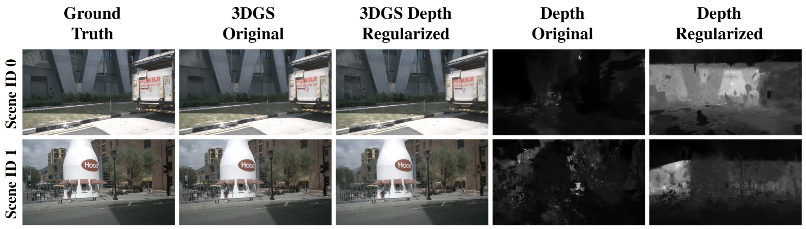
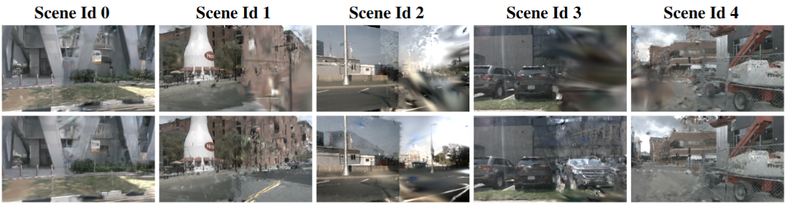
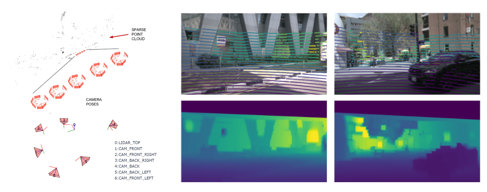

# 3D Gaussian Splatting with NuScenes Dataset

This work presents an improved 3D Gaussian splatting (3DGS) based scene representation for autonomous driving scenarios using LiDAR-based depth regularization. The original 3DGS implementation does not explicitly account for 3D structure in its optimization and suffers in performance for sparse inputs and larger scenes, which are common in driving datasets. Infusing a depth prior can support the optimization, especially in a sparse set of images. In our study, we use the NuScenes dataset to compare the depth-regularized method against the original 3DGS implementation. Our results demonstrate that depth-regularized 3DGS shows significant improvement in depth estimates while providing comparable RGB renders. Further, qualitative assessments of novel view synthesis reveal reduced artifacts with our approach.

  

## Usage Guide  
*For Windows only*

### Requirements

1. Download [Nuscenes dataset](https://www.nuscenes.org/nuscenes#download) in `data/sets/nuscenes`. (suppported version: v1.0-mini)

2. Install [COLMAP](https://colmap.github.io/install.html)

3. Install the required dependencies:  
    ```bash
    pip install -r requirements.txt
    ``` 
### Preparing the dataset for 3DGS optimization 
Run the script with configurable parameters:  
```bash
python process_nuscenes_colmap.py --scene_idx 1 --samples_per_scene 1 --set_size 5 --use_lidar
```

#### Arguments  
- `--scene_idx`: Index of the NuScenes scene to process  
- `--samples_per_scene`: Number of samples per scene to extract  
- `--set_size`: Number of frames per set (use `<1` to process the entire sequence as a single set)  
- `--use_lidar`: Flag to enable LiDAR data processing  

This will create a directory in `data/colmap_data/<scene-idx>`. 

**Note: Run the batch file for every sample `data/colmap_data/<scene-idx>/sample-<idx>/batch.bat` to generate the sparse data required for 3DGS.** 

### 3GGS Optimization with Depth Regularization

Clone the forked repository of the original 3DGS implementation. 

```
https://github.com/sacrover/gaussian-splatting.git --recursive
``` 
Train 3DGS with depth regularization. 

```
python train.py -s <path to COLMAP dataset> --depth-regularization
```

## Rendering

```
python render.py -m <path to trained model>

python render_novel.py -m <path to trained model> # novel view rendering
```

## Training View Rasterization


## Novel View Synthesis
Novel views rasterized using 3DGS Original (Top row) and 3DGS LiDAR Depth Regularized (Bottom row).



## COLMAP Setup (Left) and Dense Depth Map Estimation with LiDAR Data (Right)



## Acknowledgements

1. 3D Gaussian Splatting (3DGS): https://github.com/graphdeco-inria/gaussian-splatting
2. nuscenes-devkit: https://github.com/nutonomy/nuscenes-devkit
3. Depth Regularized 3DGS: https://github.com/robot0321/DepthRegularizedGS
